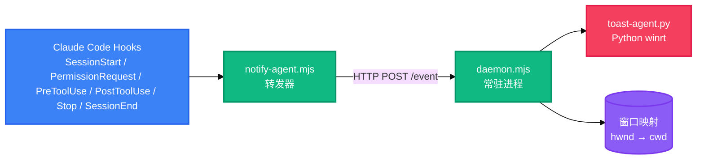

<div align="right">

[English](README.md) · 中文

</div>

<h1 align="center">cc-notifier</h1>

<p align="center">
  <strong>Claude Code 会话的 Windows 桌面通知</strong>
  <br />
  <em>权限请求 · 提问 · 工具报错 · 等待输入</em>
</p>

<p align="center">
  <a href="#快速开始"></a>
  <a href="LICENSE"></a>
</p>

<p align="center">
  <a href="https://docs.anthropic.com/en/docs/claude-code"></a>
  
  
  
</p>

<p align="center">
  <a href="README.md">English</a> · 中文
</p>

cc-notifier 在 Claude Code 需要你介入、而你未聚焦于会话窗口时提醒你:Claude 请求工具权限、向你提问、完成一轮输出或工具执行出错时,弹出带声音的 Windows 原生 Toast;点击 Toast 即可将会话窗口带回前台。零第三方 npm 依赖。

## 功能特性

| 功能 | 说明 |
|---|---|
| 中断事件通知 | 覆盖权限请求、AskUserQuestion 提问、工具失败、Stop(等待输入)四类中断时刻 |
| 聚焦感知 | 会话窗口聚焦时静默,失焦时才通知 |
| 原生 Toast | Python winrt 显示带声音的 Windows Toast;点击跳转走进程内 `Activated` 回调 |
| 点击跳转 | `SetForegroundWindow` 精确聚焦会话窗口,通过进程工作目录与终端标签身份解析 |
| 多会话 | 每个会话绑定各自窗口句柄;Toast 携带项目名,多会话可区分 |
| 去重 | 失焦时同类事件在 10 秒窗口内合并 |

## 快速开始

### 安装前提

- Windows 10 或 11
- Node.js 18 及以上
- Python 3 及 winrt 包:`pip install winrt-runtime winrt-Windows.UI.Notifications winrt-Windows.Data.Xml.Dom`

### 安装

```bash
node scripts/install.mjs
```

安装器会备份 `~/.claude/settings.json`、注入六个 hooks、注册 `cc-notifier` AppUserModelID 并生成默认配置。安装后需新开 Claude Code 会话生效。

### 验证

```bash
npm test
node scripts/test.mjs permission-request   # 可选:permission-request、ask-user-question、tool-result、stop、session-start
```

## 使用方法

### 经真实管线手动触发

```bash
node scripts/test.mjs ask-user-question
```

需要 daemon 正在运行(即有活跃会话)。先让会话窗口失焦——聚焦时会静默,不弹通知。

### 项目级关闭

项目根目录创建 `.claude/cc-notifier.json`:

```json
{ "enabled": false }
```

优先级:项目级 > 全局 `~/.cc-notifier/config.json` > 默认值。

### 卸载

```bash
node scripts/uninstall.mjs
```

移除注入的 hooks、恢复安装前 settings.json 备份、清理 AUMID 注册。

## 架构

整条管线仅在会话活跃期间运行,事件驱动,全部会话结束后不留后台进程。



转发器解析每个 hook 事件、规范化为统一载荷,经 `daemon.json` 协商的本地 HTTP 端口转发给常驻 daemon。daemon 维护会话集合与窗口映射表,判定聚焦、去重,并拉起 `toast-agent.py`。daemon 不可用时,转发器降级为无跳转的基础 Toast。

## 配置

`~/.cc-notifier/config.json`(安装时生成):

| 键 | 默认 | 说明 |
|---|---|---|
| `enabled` | `true` | 设为 `false` 全局关闭通知 |
| `dedupWindowMs` | `10000` | 失焦时同类事件去重窗口(毫秒) |
| `sound` | `true` | 设为 `false` 时 Toast 静音 |

## 项目结构

```
scripts/
├── notify-agent.mjs    # hook 转发器:解析 → 规范化 → HTTP POST
├── daemon.mjs           # 常驻进程:会话、窗口映射、聚焦、去重
├── toast-agent.py       # Python winrt Toast + 点击跳转回调
├── install.mjs          # hooks 注入、AUMID 注册、配置初始化
├── uninstall.mjs        # hooks 移除、备份恢复、AUMID 清理
├── test.mjs             # 经真实管线手动触发事件
└── lib/
    ├── events.mjs       # 事件模型、解析、Toast 文案
    ├── window-map.mjs   # 窗口标题 → cwd 解析、进程白名单
    ├── proc-dir.mjs     # 命令行工作目录解析
    ├── focus.mjs        # 聚焦判定
    ├── dedup.mjs        # 同类事件窗口去重
    ├── config.mjs       # 全局 + 项目配置合并
    ├── state.mjs        # daemon.json 单实例状态
    ├── logger.mjs       # 轮转文件日志
    └── win32.mjs/.ps1   # PowerShell 桥:枚举/前台窗口
test/                    # 5 个测试文件,45 条断言(node:test)
```

## 技术栈

| 层 | 技术 | 用途 |
|---|---|---|
| 运行时 | Node.js 18+ | hook 转发器与常驻 daemon |
| 通知 | Python 3 + winrt | Windows Toast 显示与 `Activated` 回调 |
| 窗口桥 | PowerShell 5.1+ | P/Invoke `EnumWindows`/`GetForegroundWindow` |
| 测试 | `node:test` | 5 个文件 45 条断言 |
| 依赖 | 无 | 零第三方 npm 包 |

## 日志与状态

运行时文件位于 `%LOCALAPPDATA%\cc-notifier\`:

| 文件 | 用途 |
|---|---|
| `daemon.json` | 常驻进程端口/pid(单实例握手) |
| `notify-agent.log`、`daemon.log`、`toast-click.log` | 运行日志(超 1 MB 自动截断) |
| `history.jsonl` | 本地通知历史 |

## 故障排查

- **无通知** — 确认安装后新开了会话、`enabled` 未关闭、会话窗口失焦、AUMID 已注册(重跑 `install.mjs`)
- **点击不跳转** — 常驻进程未运行(查看 daemon.log)或窗口标题不含项目名,窗口句柄无法绑定
- **Toast 不显示** — 确认 Python 与 winrt 包已安装(安装器会检测),以及 AUMID 注册(`reg query HKCU\Software\Classes\AppUserModelId\cc-notifier`)
- **hook 未触发** — 检查 `~/.claude/settings.json` 的 hooks 条目是否被其他工具覆盖(重跑 `install.mjs`)

## 贡献

完整流程见 [CONTRIBUTING.md](CONTRIBUTING.md)。简要步骤:

1. Fork 本仓库
2. 创建功能分支(`git checkout -b feature/your-change`)
3. 提交改动(`git commit -m 'fix: describe the change'`)
4. 推送到分支(`git push origin feature/your-change`)
5. 发起 Pull Request

安全问题:见 [SECURITY.md](SECURITY.md)。

## 许可证

[MIT](LICENSE)
