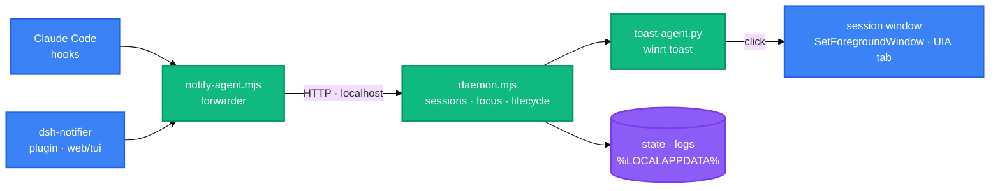

<h1 align="center">cc-notifier</h1>

<p align="center">
  <strong>Claude Code 与 DeepSeek Harness 会话的 Windows 桌面通知系统</strong>
  <br />
  <em>权限请求 · 提问 · 工具报错 · 等待输入 · 点击跳转</em>
</p>

<p align="center">
  <a href="#快速开始"></a>
  <a href="LICENSE"></a>
</p>

<p align="center">
  <a href="https://github.com/baobaolaodie/cc-notifier/releases"></a>
  <a href="https://docs.anthropic.com/en/docs/claude-code"></a>
  
  
  
  
</p>

<p align="center">
  <a href="README.md">English</a> · 中文
</p>

cc-notifier 在代理需要你介入、而你没有看着它的窗口时,弹出带声音的原生 Windows Toast。它通过 hook 体系服务 Claude Code,通过一个小型组合包插件服务 DeepSeek Harness,两者共用同一条 daemon 管线。点击 Toast 即可回到会话窗口。零第三方 npm 依赖。

## 功能特性

| 功能 | 说明 |
|---|---|
| 中断事件 | 权限请求、提问、工具报错、等待输入均会通知 |
| 聚焦感知 | 会话窗口聚焦时静默,失焦时才通知 |
| 点击跳转 | `SetForegroundWindow` 聚焦会话窗口;浏览器 tab 经 UIA 激活 |
| 多会话 | 每个会话绑定各自窗口句柄;Toast 携带会话身份 |
| 本地化通知 | Toast 文案跟随系统显示语言(`auto`)或 `language` 设置(`zh`/`en`) |
| DeepSeek Harness | `dsh-notifier` 插件一次安装覆盖 web 与 tui 两个 profile |

## 快速开始

### 安装前提

- Windows 10 或 11
- Node.js 18 或更高版本
- Python 3 与 winrt 包:`pip install winrt-runtime winrt-Windows.UI.Notifications winrt-Windows.Data.Xml.Dom`

### 安装(Claude Code)

```bash
node scripts/install.mjs
```

安装器会备份 `~/.claude/settings.json`、注入六个 hooks、注册 `cc-notifier` AppUserModelID 并写入默认配置。之后新建 Claude Code 会话即可生效。

### 安装(DeepSeek Harness)

```bash
# 仓库根目录执行;务必使用相对路径
dsh plugin --profile web add ./plugins/dsh-notifier
dsh plugin --profile dsh-tui add ./plugins/dsh-notifier
```

### 验证

```bash
npm test
```

## 使用方法

### Claude Code

启动会话后切走。Claude 请求权限、提问、完成回合或工具报错时,系统会通知你:

```bash
claude
# 切到其他窗口;Claude 需要你时弹出 Toast
```

### DeepSeek Harness

插件把 dsh 会话事件转发进同一条管线。web 会话绑定浏览器窗口,tui 会话绑定终端窗口:

```bash
dsh web          # 或:dsh --profile web
dsh-tui          # 或:dsh --profile dsh-tui
```

### 手动触发(测试)

```bash
node scripts/test.mjs permission-request   # permission-request | ask-user-question | tool-result | stop | session-start
```

目标窗口聚焦时 Toast 会被静默,因此请切走窗口观察。

### 配置

编辑 `~/.cc-notifier/config.json`(安装时生成):

| 键 | 默认 | 说明 |
|---|---|---|
| `enabled` | `true` | 设为 `false` 全局关闭通知 |
| `dedupWindowMs` | `0` | 去重窗口(毫秒);`0` = 不去重;`>0` 时按「会话+类型」合并 |
| `pythonPath` | 空 | Toast 解释器绝对路径(安装时写入);空 = 用 PATH 上的 `python` |
| `pollIntervalMs` | `10000` | daemon 窗口轮询周期(毫秒) |
| `windowWhitelist` | `[]` | 浏览器进程白名单(dsh web 绑定/聚焦用,如 `chrome.exe`/`msedge.exe`) |
| `sound` | `true` | 设为 `false` 时 Toast 静音 |
| `language` | `auto` | Toast 语言:`auto`(系统显示语言,`zh-*`→中文、`en-*`→英文,其他/失败→英文)、`zh` 或 `en` |

## 架构

事件驱动管线只在会话活跃期间运行。Claude Code hooks 与 dsh 插件产出同构的规范化载荷;常驻 daemon 决定是否通知,Python 代理负责展示 Toast:



daemon 为单实例:按需唤醒,无会话 60 秒后退出,代码变更时自动重启。daemon 重启后会话自动重新注册。

## 项目结构

```
├── scripts/               # 运行时管线
│   ├── notify-agent.mjs   # hook 转发器(Claude Code)
│   ├── daemon.mjs         # 常驻进程:会话、聚焦、去重
│   ├── toast-agent.py     # Python winrt Toast + 点击处理
│   └── lib/               # 共享模块、win32 桥、UIA 助手
├── plugins/
│   └── dsh-notifier/      # dsh 组合包插件(web + tui profile)
├── test/                  # node:test 套件(显式文件清单)
├── docs/                  # 安装、使用、排障(双语)
└── package.json           # 零运行时依赖
```

## 技术栈

| 层 | 技术 | 用途 |
|---|---|---|
| 运行时 | Node.js 18+(ESM) | 转发器、daemon、插件 |
| 通知 | Python 3 + winrt | Windows Toast 渲染与激活 |
| 窗口桥 | PowerShell 5.1 + C# 助手 | 窗口枚举、前台查询、UIA tab 激活 |
| 测试 | node:test | 单元 + 集成测试 |

## 部署

CI 运行于 GitHub Actions(`test` × 6 矩阵,覆盖 Node 18/20/22 的 Ubuntu 与 Windows,外加 `quality`、`pr-policy`、`docs-links` 与汇总 job)。见 `.github/workflows/ci.yml`。

## 贡献

1. Fork 本仓库
2. 创建功能分支(`git checkout -b feature/your-change`)
3. 使用 Conventional Commits 提交(`feat:`、`fix:`、`docs:` 等)
4. 发起 Pull Request

PR 必须通过全部 CI 检查,包括双语文档镜像检查与版本一致性检查。详见 [CONTRIBUTING.md](CONTRIBUTING.md)。

## 许可证

[MIT](LICENSE)
