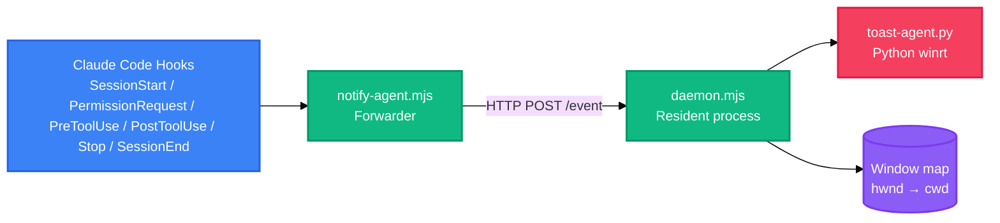

<div align="right">

English · [中文](README-zh.md)

</div>

<h1 align="center">cc-notifier</h1>

<p align="center">
  <strong>Windows desktop notifications for Claude Code sessions</strong>
  <br />
  <em>Permission requests · Questions · Tool errors · Waiting for input</em>
</p>

<p align="center">
  <a href="#quick-start"></a>
  <a href="LICENSE"></a>
</p>

<p align="center">
  <a href="https://docs.anthropic.com/en/docs/claude-code"></a>
  
  
  
</p>

<p align="center">
  English · <a href="README-zh.md">中文</a>
</p>

cc-notifier alerts you when Claude Code needs your attention but you are not looking at the session window. It raises a native Windows toast with sound when Claude requests tool permissions, asks a question, finishes a turn, or hits a tool error. Clicking the toast brings the session window back to the foreground. Zero third-party npm dependencies.

## Features

| Feature | Description |
|---|---|
| Interruption events | Notifies on permission requests, AskUserQuestion prompts, tool failures, and Stop (waiting for input) |
| Focus awareness | Suppresses notifications while the session window is focused; notifies only when it is not |
| Native toasts | Windows toast with sound via Python winrt; click-to-return uses the in-process `Activated` callback |
| Click-to-focus | `SetForegroundWindow` targets the exact session window, resolved by process working directory and terminal tab identity |
| Multi-session | Each session binds its own window handle; toasts carry the project name so sessions are distinguishable |
| Deduplication | Same-type events merge within a 10-second window while unfocused |

## Quick Start

### Prerequisites

- Windows 10 or 11
- Node.js 18 or later
- Python 3 with the winrt packages: `pip install winrt-runtime winrt-Windows.UI.Notifications winrt-Windows.Data.Xml.Dom`

### Install

```bash
node scripts/install.mjs
```

The installer backs up `~/.claude/settings.json`, injects six hooks, registers the `cc-notifier` AppUserModelID, and writes the default config. Open a new Claude Code session afterwards.

### Verify

```bash
npm test
node scripts/test.mjs permission-request   # pick one: permission-request, ask-user-question, tool-result, stop, session-start
```

## Usage

### Manual trigger through the real pipeline

```bash
node scripts/test.mjs ask-user-question
```

The daemon must be running (a session is active). Switch focus away from the session window first — toasts are suppressed while focused.

### Project-level opt-out

Create `.claude/cc-notifier.json` in the project root:

```json
{ "enabled": false }
```

Precedence: project config > global `~/.cc-notifier/config.json` > defaults.

### Uninstall

```bash
node scripts/uninstall.mjs
```

Removes injected hooks, restores the pre-install backup of `settings.json`, and clears the AUMID registration.

## Architecture

The pipeline runs only while sessions are active; it is event-driven and leaves no background process behind once all sessions close.



The forwarder parses each hook event, normalizes it, and posts it to the resident daemon over a local HTTP port negotiated via `daemon.json`. The daemon tracks sessions, maintains a window map, decides focus, deduplicates, and spawns `toast-agent.py`. If the daemon is unavailable, the forwarder degrades to a plain toast without click-to-return.

## Configuration

`~/.cc-notifier/config.json` (created on install):

| Key | Default | Description |
|---|---|---|
| `enabled` | `true` | Set to `false` to disable notifications globally |
| `dedupWindowMs` | `10000` | Deduplication window for same-type events while unfocused (ms) |
| `sound` | `true` | Set to `false` to mute toast sound |

## Project Structure

```
scripts/
├── notify-agent.mjs    # Hook forwarder: parse → normalize → HTTP POST
├── daemon.mjs           # Resident process: sessions, window map, focus, dedup
├── toast-agent.py       # Python winrt toast + click-to-return callback
├── install.mjs          # Hook injection, AUMID registration, config bootstrap
├── uninstall.mjs        # Hook removal, backup restore, AUMID cleanup
├── test.mjs             # Manual event triggers through the real pipeline
└── lib/
    ├── events.mjs       # Event model, parsing, toast copy
    ├── window-map.mjs   # Window title → cwd resolution, process whitelist
    ├── proc-dir.mjs     # Command-line working-directory resolution
    ├── focus.mjs        # Focus decision
    ├── dedup.mjs        # Same-type event window dedup
    ├── config.mjs       # Global + project config merge
    ├── state.mjs        # daemon.json single-instance state
    ├── logger.mjs       # Rotating file logger
    └── win32.mjs/.ps1   # PowerShell bridge: enumerate/foreground windows
test/                    # 5 test files, 45 assertions (node:test)
```

## Tech Stack

| Layer | Technology | Purpose |
|---|---|---|
| Runtime | Node.js 18+ | Hook forwarder and resident daemon |
| Notifications | Python 3 + winrt | Windows toast display and `Activated` callback |
| Window bridge | PowerShell 5.1+ | `EnumWindows`/`GetForegroundWindow` via P/Invoke |
| Testing | `node:test` | 45 assertions across 5 files |
| Dependencies | none | Zero third-party npm packages |

## Logs and State

All runtime files live under `%LOCALAPPDATA%\cc-notifier\`:

| File | Purpose |
|---|---|
| `daemon.json` | Resident process port/pid (single-instance handshake) |
| `notify-agent.log`, `daemon.log`, `toast-click.log` | Run logs (truncated above 1 MB) |
| `history.jsonl` | Local notification history |

## Troubleshooting

- **No notification** — confirm a new session was opened after install, `enabled` is not `false`, the session window is unfocused, and the AUMID is registered (re-run `install.mjs`).
- **Click does not return to the session** — the daemon is not running (check `daemon.log`) or the window title carries no project name, so the window handle could not be bound.
- **Toast not shown** — verify Python and the winrt packages (the installer checks), and the AUMID registration (`reg query HKCU\Software\Classes\AppUserModelId\cc-notifier`).
- **Hooks not firing** — check whether another tool overwrote the hooks entries in `~/.claude/settings.json` (re-run `install.mjs`).

## Contributing

See [CONTRIBUTING.md](CONTRIBUTING.md) for the full workflow. In short:

1. Fork the repository
2. Create a feature branch (`git checkout -b feature/your-change`)
3. Commit your changes (`git commit -m 'fix: describe the change'`)
4. Push to the branch (`git push origin feature/your-change`)
5. Open a Pull Request

Security issues: see [SECURITY.md](SECURITY.md).

## License

[MIT](LICENSE)
