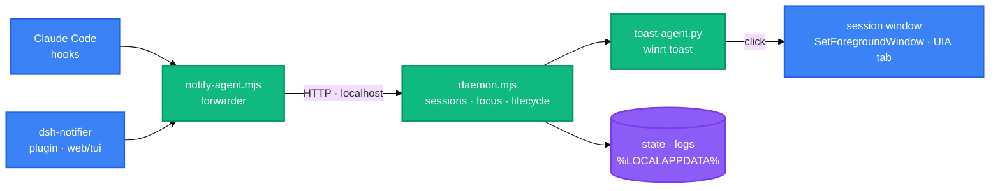

<h1 align="center">cc-dsh-notifier</h1>

<p align="center">
  <strong>Windows desktop notifications for Claude Code and DeepSeek Harness sessions</strong>
  <br />
  <em>Permission requests · Questions · Waiting for input · Click-to-return</em>
</p>

<p align="center">
  <a href="#quick-start"></a>
  <a href="LICENSE"></a>
</p>

<p align="center">
  <a href="https://github.com/baobaolaodie/cc-dsh-notifier/releases"></a>
  <a href="https://docs.anthropic.com/en/docs/claude-code"></a>
  
  
  
  
</p>

<p align="center">
  English · <a href="README-zh.md">中文</a>
</p>

cc-dsh-notifier raises a native Windows toast with sound when an agent needs your attention and you are not looking at its window. It serves Claude Code through its hook system and DeepSeek Harness through a small bundle plugin, sharing one daemon pipeline. Clicking a toast returns you to the session window. Zero third-party npm dependencies.

## Features

| Feature | Description |
|---|---|
| Interruption events | Notifies on permission requests, questions, and waiting for input |
| Focus awareness | Suppresses notifications while the session window is focused; notifies only when it is not |
| Click-to-return | `SetForegroundWindow` targets the session window; browser tabs activate via UIA |
| Multi-session | Each session binds its own window handle; toasts carry the session identity |
| Localized notifications | Toast text follows the Windows display language (`auto`) or a `language` setting (`zh`/`en`) |
| DeepSeek Harness | The `dsh-notifier` plugin covers web and tui profiles with one install |

## Quick Start

### Prerequisites

- Windows 10 or 11
- Node.js 18 or later
- Python 3 with the winrt packages: `pip install winrt-runtime winrt-Windows.UI.Notifications winrt-Windows.Data.Xml.Dom`

### Install (Claude Code)

```bash
node scripts/install.mjs
```

The installer backs up `~/.claude/settings.json`, injects five hooks, registers the `cc-notifier` AppUserModelID, and writes the default config. Open a new Claude Code session afterwards.

### Install (DeepSeek Harness)

**Recommended — download the tarball from the [latest release](https://github.com/baobaolaodie/cc-dsh-notifier/releases) and install it** (no repository clone, no credentials):

```bash
dsh plugin --profile web add ./cc-dsh-notifier-0.1.4.tgz
dsh plugin --profile dsh-tui add ./cc-dsh-notifier-0.1.4.tgz
```

**Alternative — git install** (clones the whole repository, zero config):

```bash
dsh plugin --profile web add github:baobaolaodie/cc-dsh-notifier
dsh plugin --profile dsh-tui add github:baobaolaodie/cc-dsh-notifier
```

> GitHub Packages (`@baobaolaodie/cc-dsh-notifier`) exists as a maintainer convenience channel only: the package is currently **private**, so downloads require a `read:packages` token in the profile's `.npmrc`. Use the tarball or git install instead.

Verified against dsh 0.1.0-rc.6 on Windows 11 (2026-08-16): web and tui profiles, permission/question/waiting-for-input notifications, focus-aware silence, click-to-return, and the tarball install flow.

### Verify

```bash
npm test
```

## Usage

### Claude Code

Start a session and switch away. The system notifies when Claude requests a permission, asks a question, or finishes a turn.

```bash
claude
# switch to another window; toasts appear when Claude needs you
```

### DeepSeek Harness

The plugin forwards dsh session events into the same pipeline. Web sessions bind to the browser window; tui sessions bind to the terminal window:

```bash
dsh web          # or: dsh --profile web
dsh-tui          # or: dsh --profile dsh-tui
```

### Manual trigger (testing)

```bash
node scripts/test.mjs permission-request   # permission-request | ask-user-question | stop | session-start
```

Toasts are suppressed while the target window is focused, so switch away to observe them.

### Configuration

Edit `~/.cc-notifier/config.json` (created on install):

| Key | Default | Description |
|---|---|---|
| `enabled` | `true` | Set to `false` to disable notifications globally |
| `dedupWindowMs` | `0` | Deduplication window (ms); `0` = no dedup; `>0` merges per session+type |
| `pythonPath` | empty | Absolute path of the toast interpreter (written by the installer); empty = `python` from PATH |
| `pollIntervalMs` | `10000` | Daemon window-poll period (ms) |
| `windowWhitelist` | `[]` | Browser process whitelist for dsh web binding/focus (e.g. `chrome.exe`/`msedge.exe`) |
| `sound` | `true` | Set to `false` to mute toast sound |
| `language` | `auto` | Toast language: `auto` (system display language, `zh-*`→zh, `en-*`→en, other/failure→en), `zh`, or `en` |

## Architecture

An event-driven pipeline runs only while sessions are active. Claude Code hooks and the dsh plugin both produce the same normalized payloads; a resident daemon decides whether to notify, and a Python agent shows the toast:



The daemon is single-instance: it wakes on demand, exits after 60 seconds of no sessions, and self-restarts when its code changes. Sessions re-register automatically after a daemon restart.

## Project Structure

```
├── scripts/               # Runtime pipeline
│   ├── notify-agent.mjs   # Hook forwarder (Claude Code)
│   ├── daemon.mjs         # Resident process: sessions, focus, dedup
│   ├── toast-agent.py     # Python winrt toast + click handling
│   └── lib/               # Shared modules, win32 bridge, UIA helpers
├── plugins/
│   └── dsh-notifier/      # dsh bundle plugin (web + tui profiles)
├── test/                  # node:test suite (explicit file list)
├── docs/                  # Installation, usage, troubleshooting (bilingual)
└── package.json           # Zero runtime dependencies
```

## Tech Stack

| Layer | Technology | Purpose |
|---|---|---|
| Runtime | Node.js 18+ (ESM) | Forwarder, daemon, plugin |
| Notifications | Python 3 + winrt | Windows toast rendering and activation |
| Window bridge | PowerShell 5.1 + C# helpers | Window enumeration, foreground query, UIA tab activation |
| Testing | node:test | Unit + integration tests |

## Deployment

CI runs on GitHub Actions (`test` × 6 matrix across Node 18/20/22 on Ubuntu and Windows, plus `quality`, `pr-policy`, `docs-links`, and a summary job). See `.github/workflows/ci.yml`.

## Contributing

1. Fork the repository
2. Create a feature branch (`git checkout -b feature/your-change`)
3. Commit with Conventional Commits (`feat:`, `fix:`, `docs:`, …)
4. Open a Pull Request

PRs must pass the full CI suite, including the bilingual documentation mirror check and version consistency checks. See [CONTRIBUTING.md](CONTRIBUTING.md).

## License

[MIT](LICENSE)
